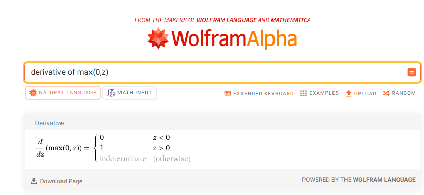
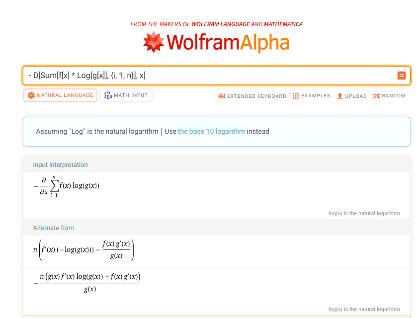
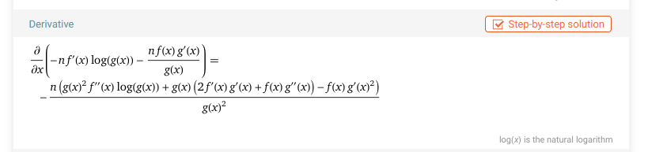
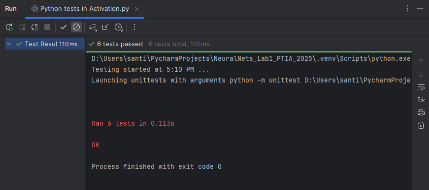
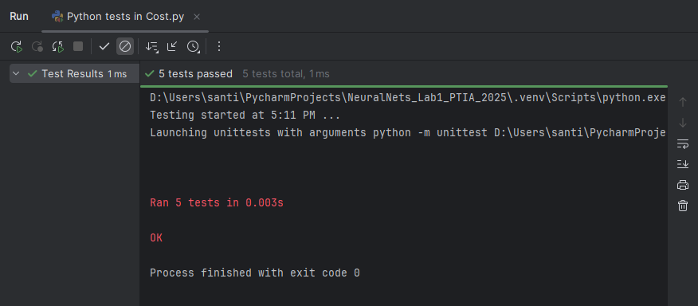
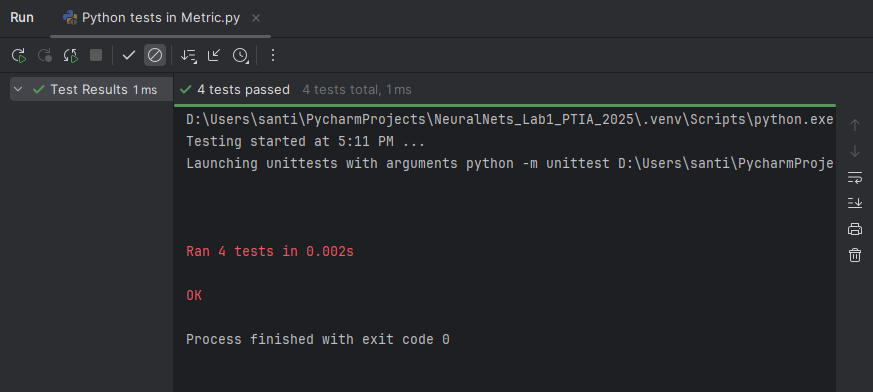

# REDES NEURONALES

**ESCUELA COLOMBIANA DE INGENIERÍA**

**PRINCIPIOS Y TECNOLOGÍAS IA 2025-2**

## Integrantes
- Andres Felipe Calderon Ramirez - [andrescalderonr](https://github.com/andrescalderonr)
- Santiago Botero Garcia - [LePeanutButter](https://github.com/LePeanutButter)

## PARTE I. IMPLEMENTACIÓN DE RED NEURONAL

### Descripción general

En el desarrollo de redes neuronales, el cálculo de las derivadas de las funciones de activación y de costo es esencial para la actualización de los pesos durante el proceso de retropropagación. Estas derivadas permiten que la red aprenda a partir de los errores en las predicciones y ajuste sus parámetros de manera eficiente. A continuación se detallan las derivadas de las funciones de activación Sigmoide y ReLU, así como de la función de costo de Entropía Cruzada, las cuales son fundamentales para la implementación de esta red neuronal.

### Cálculo de las Derivadas

Para obtener las derivadas de las funciones utilizadas en esta implementación, se utilizó [Wolfram Alpha](https://www.wolframalpha.com/), una herramienta computacional avanzada que facilita el cálculo simbólico y la verificación de expresiones matemáticas. Esto permitió asegurar la precisión en el desarrollo de las derivadas, garantizando resultados correctos para la implementación de la red neuronal.

#### Derivada función Sigmoide:

La función Sigmoide es una de las activaciones más comunes, especialmente en redes neuronales para clasificación binaria. Se utilizó el siguiente comando en Wolfram Alpha para calcular la derivada de la función sigmoide: `derivative of 1 / (1 + (e ^ (-z)))`

Como resultado, se obtuvo que la derivada de la función

$\frac{d}{dz} \left( \frac{1}{1 + e^{-z}} \right) = \frac{e^{-z}}{(1 + e^{-z})^2}$

Esta derivada es utilizada para actualizar los pesos en el proceso de retropropagación durante el entrenamiento de la red neuronal.

#### Derivada función ReLU:

La función ReLU (Rectified Linear Unit) es ampliamente utilizada por su simplicidad y eficiencia. Al utilizar el comando `derivative of max(0,z)`, en Wolfram Alpha, se obtiene que su derivada es:

$$
f'(z) =
\begin{cases}
0 & \text{si } z < 0 \\
1 & \text{si } z > 0 \\
\text{indefinida} & \text{si } z = 0
\end{cases}
$$

Esta derivada es fundamental para las redes neuronales que usan ReLU, especialmente en el cálculo del gradiente durante el proceso de entrenamiento.

#### Derivada función de costo: Entropia Cruzada:

La función de costo de Entropía Cruzada se utiliza comúnmente en problemas de clasificación. La función de Entropía Cruzada se utiliza comúnmente en problemas de clasificación, utilizando el comando `- D[Sum[f[x] * Log[g[x]], {i, 1, n}], x]`, en Wolfram Alpha, se obtiene que su derivada es:

$\frac{n \left( g(x)^2 f''(x) \log(g(x)) + g(x) \left[ 2 f'(x) g'(x) + f(x) g''(x) \right] - f(x) g'(x)^2 \right)}{g(x)^2}$

Esta expresión se calcula también a través de herramientas computacionales, y se utiliza para calcular el gradiente del error en la retropropagación, permitiendo la optimización del modelo.

### Implementación Técnica en el Laboratorio

Este laboratorio ha implementado un conjunto de clases para manejar funciones de activación, funciones de costo, métricas de rendimiento y su integración en redes neuronales. A continuación, se detallan las implementaciones principales y su organización.

#### Gestión de Funciones de Activación

Las funciones de activación son componentes clave en las redes neuronales, ya que determinan cómo se transforman las entradas de cada capa. En este laboratorio, la gestión de las funciones de activación se ha diseñado de manera que se pueda agregar soporte para nuevas funciones sin modificar el código central.

- **Clase Base** `Activation`: Proporciona una interfaz común para todas las funciones de activación, definiendo los métodos esenciales como value y derivative. Esto asegura que cualquier nueva función de activación que se agregue pueda integrarse sin conflictos, respetando la estructura ya establecida.
- **Instanciación Dinámica**: El uso de un mapa de clases (activation_map) en la clase Activation permite asociar cada tipo de activación con su respectiva clase. Esto facilita la selección y creación dinámica de las funciones de activación en función de su nombre, mediante el método use(cls, name: str). Así, se simplifica la integración de nuevas activaciones al sistema.

#### Gestión de Funciones de Costo

Las funciones de costo son fundamentales para la evaluación del error entre las predicciones del modelo y los valores reales. En este laboratorio, se ha implementado una estructura que permite definir y gestionar diferentes tipos de funciones de costo de manera flexible.

- **Clase Base** `Cost`: Al igual que las funciones de activación, se define una clase abstracta Cost, que establece los métodos básicos que todas las funciones de costo deben implementar. Esto asegura que el sistema sea extensible, permitiendo la integración de nuevas funciones de costo con facilidad.
- **Extensibilidad y Modularidad**: El patrón de diseño Factory Method se utiliza para crear instancias de las funciones de costo basándose en el nombre proporcionado, lo que facilita la inclusión de nuevas funciones de costo sin intervención en el código base.

#### Métricas de Rendimiento

Las métricas de rendimiento son esenciales para evaluar la efectividad de un modelo de red neuronal. Este laboratorio facilita la integración de nuevas métricas, permitiendo que la evaluación del modelo sea sencilla y dinámica.

- **Clase Base** `Metric`: La clase Metric proporciona la estructura básica para cualquier métrica de evaluación, con un enfoque modular que facilita la adición de nuevas métricas de manera eficiente. Esto asegura que, en el futuro, puedan incorporarse métricas personalizadas sin modificar el núcleo del sistema.
- **Método de Selección Dinámica**: Al igual que con las funciones de activación y costo, las métricas están registradas en un mapa (metric_map) que permite la creación dinámica de objetos de métricas, facilitando la personalización de los procesos de evaluación según sea necesario.

#### Patrón de Diseño y Modularidad

El sistema está basado en el patrón de diseño Factory Method, que proporciona flexibilidad al permitir la creación dinámica de instancias de activaciones, costos y métricas a partir de nombres proporcionados como entradas. Esta aproximación elimina la necesidad de modificaciones manuales en el código cuando se desea agregar una nueva función o métrica, reduciendo significativamente los posibles errores y aumentando la mantenibilidad del sistema.

El uso de un mapa para cada tipo de componente (activación, costo, métrica) hace que el sistema sea fácilmente extensible, pues cada nueva clase se registra en su respectivo mapa sin afectar al resto del sistema.

##### Pruebas de Aceptación Implementadas

Para garantizar la correcta implementación y funcionamiento de las funciones de activación, las funciones de costo y las métricas de rendimiento, se desarrollaron pruebas de aceptación exhaustivas. Estas pruebas cubren una variedad de escenarios para cada componente, asegurando que las operaciones se realicen correctamente bajo condiciones típicas y de borde.

1. **Pruebas de Funciones de Activación:**

    Se implementaron un total de 6 pruebas para verificar el comportamiento de las funciones de activación. A continuación, se describen las principales:
    
    - **Prueba de ReLU:**
    
      - Prueba de valor para entradas positivas: Se verificó que la función ReLU devuelve los valores de entrada cuando son positivos.
      - Prueba de valor para entradas negativas y cero: Se comprobó que ReLU devuelve cero cuando la entrada es negativa o igual a cero.
      - Prueba de derivada de ReLU: Se validó que la derivada de ReLU es 0 para entradas menores o iguales a 0 y 1 para entradas mayores a 0.
    
    - **Prueba de Sigmoid:**
    
      - Prueba de valor en 0: Se verificó que la función Sigmoid devuelve un valor de 0.5 cuando la entrada es 0.
      - Prueba de rango de salida de Sigmoid: Se comprobó que la salida de Sigmoid siempre se encuentra en el rango [0, 1] incluso para entradas extremas.
      - Prueba de derivada de Sigmoid: Se validó que la derivada de Sigmoid en 0 es 0.25.

    

    Estas pruebas fueron ejecutadas con éxito, confirmando que las funciones de activación implementadas responden de acuerdo a las especificaciones esperadas.

2. Pruebas de Funciones de Costo

    Se implementaron 5 pruebas para evaluar la correcta implementación de las funciones de costo. Las pruebas cubren lo siguiente:

    - **Prueba de valor básico para Cross-Entropy:** Se verificó que la función Cross-Entropy calcule correctamente el valor de la pérdida para un conjunto de etiquetas reales y probabilidades predichas. La fórmula de la entropía cruzada fue validada con un cálculo manual.
    - **Prueba de forma de la derivada:** Se aseguró que la derivada de la función Cross-Entropy tenga la misma forma que la matriz de etiquetas reales.
    - **Pruebas de manejo de errores:** Se verificaron condiciones de error tales como la discrepancia en las formas de las matrices de etiquetas y probabilidades predichas, y valores de probabilidades fuera del rango [0, 1], como 0 o 1, que podrían causar problemas al calcular el logaritmo.

    

    Todas las pruebas fueron aprobadas exitosamente, garantizando que las funciones de costo manejen correctamente todos los casos de uso y las excepciones.

3. Pruebas de Métricas de Rendimiento

    Se implementaron 4 pruebas para validar el comportamiento de las métricas de rendimiento. En particular, se probó la métrica de precisión (accuracy) con los siguientes escenarios:

    - **Prueba de precisión perfecta:** Se verificó que cuando todas las predicciones son correctas, la precisión sea 1.0.
    - **Prueba de precisión parcial:** Se validó que, cuando algunas predicciones son incorrectas, la precisión se calcule correctamente (en este caso, 0.75).
    - **Prueba de precisión cero:** Se comprobó que cuando todas las predicciones son incorrectas, la precisión sea 0.0.
    - **Prueba de manejo de error en discrepancia de formas:** Se validó que la función de precisión levante una excepción cuando las formas de las etiquetas reales y las predicciones no coincidan.

    

    Todas las pruebas de las métricas fueron exitosas, lo que asegura que las métricas de rendimiento se calculen de manera confiable y correcta en cualquier situación.