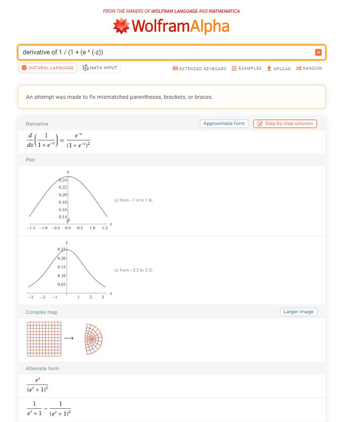
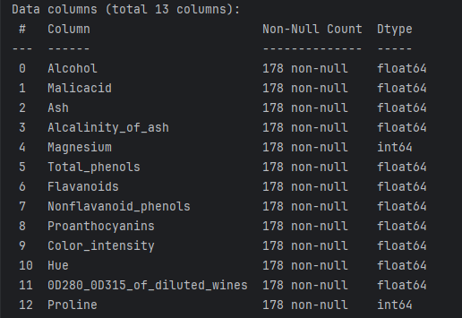
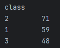
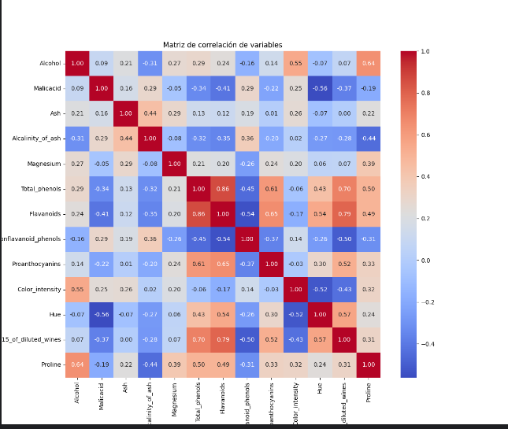

# REDES NEURONALES

**ESCUELA COLOMBIANA DE INGENIERÍA**

**PRINCIPIOS Y TECNOLOGÍAS IA 2025-2**

## Integrantes
- Andres Felipe Calderon Ramirez - [andrescalderonr](https://github.com/andrescalderonr)
- Santiago Botero Garcia - [LePeanutButter](https://github.com/LePeanutButter)

## PARTE I. IMPLEMENTACIÓN DE RED NEURONAL

Para obtener las derivadas de las funciones utilizadas en esta implementación, se utilizó [Wolfram Alpha](https://www.wolframalpha.com/), una herramienta computacional avanzada que facilita el cálculo simbólico y la verificación de expresiones matemáticas. Esto permitió asegurar la precisión en el desarrollo de las derivadas, garantizando resultados correctos para la implementación de la red neuronal.

### Derivada función Sigmoide:
Se utilizó el siguiente comando en Wolfram Alpha para calcular la derivada de la función sigmoide: `derivative of 1 / (1 + (e ^ (-z)))`

Como resultado, se obtuvo que la derivada de la función

$\frac{d}{dz} \left( \frac{1}{1 + e^{-z}} \right) = \frac{e^{-z}}{(1 + e^{-z})^2}$

### Derivada función ReLU:

Para hacer la derivada lo que hicimos fue que en el programa Wolfram Alpha colocamos el comando `derivative of max(0,z)`, el resultado fue el siguiente:

### Derivada función de costo: Entropia Cruzada:

Para poder hacer la derivada de la función de Entropia Cruzada, entramos a WolframAplha y usamos el comando `- D[Sum[f[x] * Log[g[x]], {i, 1, n}], x]`

# Parte 2:

## Paso 1:

El problema es que debemos hacer una clasificación de clases, debemos predecir a que clase pertenece un vino segun sus caracteristicas quimicas utilizando el dataset de vinos, cave tener en cuenta que cada vino solo hace parte de una sola clase.

La metrica que se selecciono fue la de exactitud al permitir medir la cantidad de vinos que fueron clasificados de forma correcta sobre el total de muestras.

## Paso 2:

### Exploración del dataset:

Tenemos un total de 3 clases diferentes de vinos y un total de 13 diferentes medidas de elementos quimicos para los vinos, tenemos un total de 178 vinos en el dataset y tampoco tenemos

Como se puede ver en la imagen si hay correlación entre los diferentes elementos quimicos, un ejemplo es que total_phenols y flavanoids tienen una correlacion de 0.86, indicando que si hay alguno de los 2 elementos quimicos, el otro aumentara en proporciones parecidas.  Tambien hay correlaciones negativas como flavanoids y nonflavanoid_phenols con una correlacion de -0.44 indicando que si hay un elemento el otr disminuira. Por ultimo hay correlaciones nulas como puede ser magnesium y hue con una correlacion de 0.02 indicando que hay independencia entre ambos elementos.